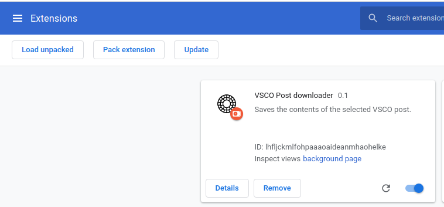
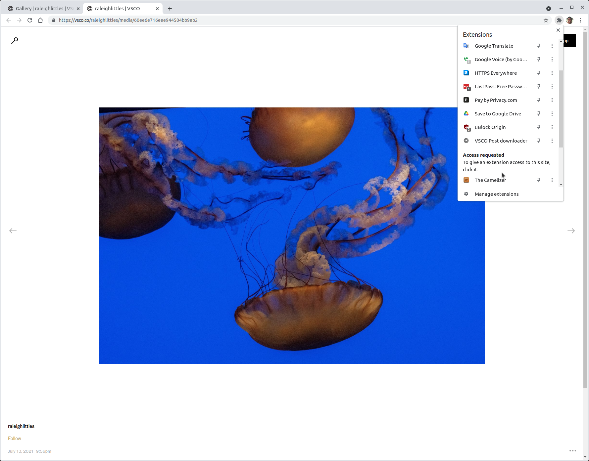

# About

This is a Chrome extension for downloading posts from VSCO - a social network similar to Instagram.

**Warning: Currently only image posts are supported, NOT videos.**

# Installation

1. Go to the main chrome extensions page: `chrome://extensions`

2. Click "Load unpacked"

3. Point to the directory where you cloned this repo.

# Usage

Navigate to a specific VSCO post. Then click on the "VSCO post downloader" browser action within Chrome:

